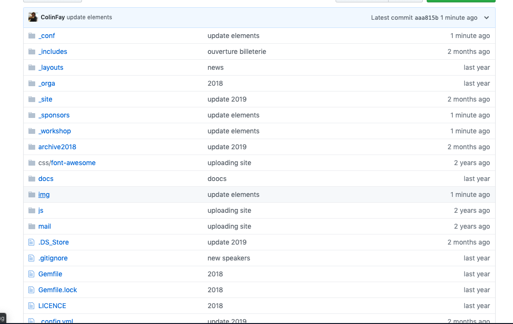
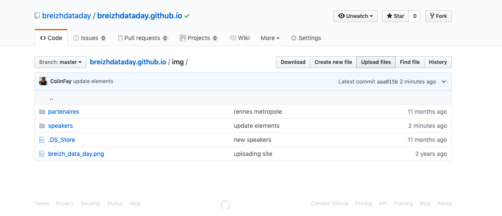
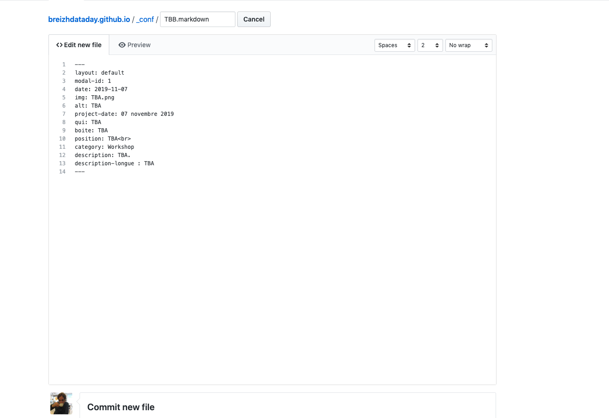
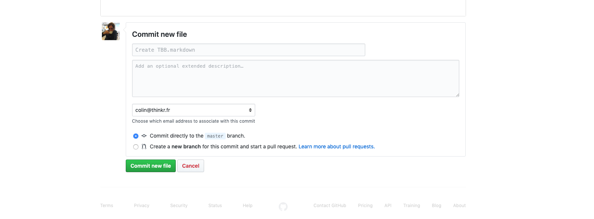
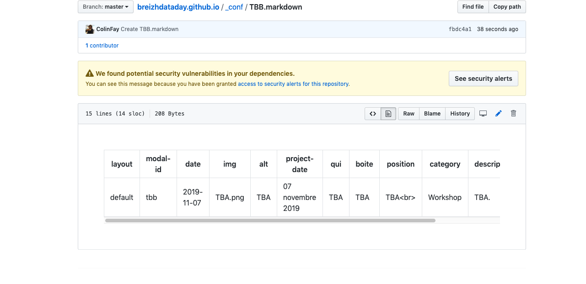

## Créer compte GitHub

Envoyer à Colin pour qu'ils vous donne accès à 

https://github.com/breizhdataday/breizhdataday.github.io

## Créer un speaker 



-> Ajouter sa photo dans le dossier img/speaker, en cliquand sur le bouton "Add files" en haut à droite. 

Taille des photos : 300x300



-> Créer un nouveau fichier dans _conf ou _workshop : le premier est pour le grand public, le second pour tech. Il y a un bouton "create new file" en haut à droite.

-> appeler ce fichier `nom-prenom.markdown`

-> Dans ce fichier, copier et remplir : 

```
---
layout: default
modal-id: 1
date: 2019-11-07
img: TBA.png
alt: TBA
project-date: 07 novembre 2019
qui: TBA
boite: TBA
position: TBA<br>
category: Workshop
description: TBA.
description-longue : TBA
---
```

+ Modifiez le modal-id avec `prenomnom`, pour prenom nom du speakder
+ img : le nom du fichier image
+ alt : prenom-nom du speaker
+ qui : prenom et nom en toutes lettres
+ boite : société 
+ position : poste occupé (laissez le `<br>`)
+ category : Workshop ou Conférence (correspond à tech ou grand public)
+ description : descritpion courte de la conf
+ description-longue : description longue de la conf 

__Attention, Aucun de ces champs ne doit contenir de `:` dans leurs contenus__


 
Cliquer sur "Commit new file" tout en bas de la page



## Modifier 

+ Ouvrir le fichier sur Github

+ Cliquer sur le crayon en haut à droite 



+ cliquer sur "commit changes" en bas de la page

## Supprimer fichier 

+ Plutôt que Crayon, on va cliquer sur Poubelle

## Publier

Pas besoin de vous occuper de la publication, le site se met à jour dès que vous cliquez sur "Commit..."  dans les étapes du dessus.